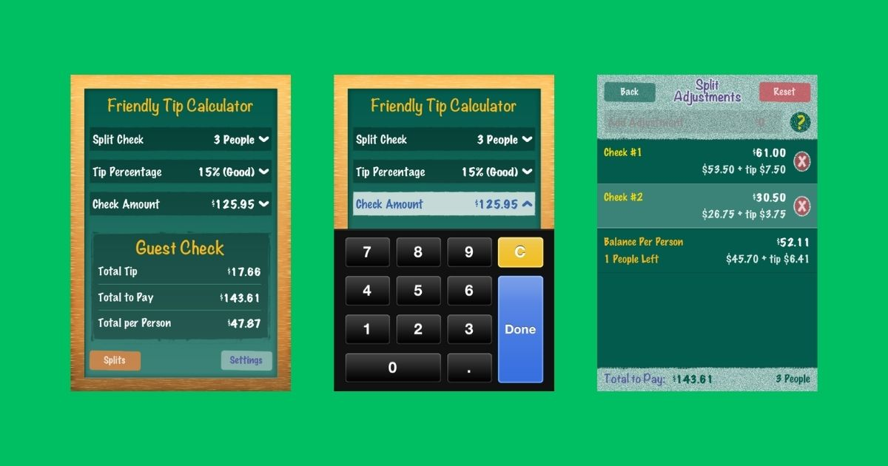

# Tip Calculator

A native iOS tip calculator application with bill splitting and adjustment features. Originally developed for iOS App Store distribution with both free and paid versions.

## Features

- **Tip Calculation**: Calculate tips with customizable percentages
- **Bill Splitting**: Split bills among multiple people (2-20 splits)
- **Individual Adjustments**: Add custom adjustments for specific people in the group
- **Guest Check View**: Visual representation of the bill breakdown
- **Settings Management**: Save preferred tip percentages and default settings
- **Dual Versions**: Separate free and full versions with feature differentiation

## Technical Details

- **Platform**: iOS (iPhone/iPad)
- **Language**: Objective-C
- **Framework**: UIKit
- **Architecture**: Model-View-Controller (MVC)
- **Data Persistence**: NSCoding with file-based storage
- **Analytics**: Localytics integration for user behavior tracking
- **Precision**: NSDecimalNumber for accurate currency calculations

### Core Architecture

**Model Layer**:
- `Check.h/.m`: Central business logic for tip calculations, bill splitting, and adjustments
- `Settings.h/.m`: User preferences and configuration persistence

**View Controllers**:
- `SummaryViewController`: Main calculation interface
- `AdjustmentsViewController`: Individual bill split adjustments
- `SettingsViewController`: App configuration
- `TaxViewController`, `TableSelectViewController`: Additional input screens

**Custom UI Components**:
- `RLNumberPad`: Custom number pad for currency input
- `InputDisplayView`: Custom input display components
- `GuestCheckView`: Visual bill representation
- `AdjustmentView`/`AdjustmentViewCell`: Custom table view components

**Data Management**:
- NSCoding protocol for object serialization
- `FileHelpers` utility class for file operations
- Check data archived/unarchived via `TipCalculatorAppDelegate`

### Development Patterns

- Extensive use of NSDecimalNumber for currency precision
- Custom category extensions (`NSDecimalNumber+Check`, `UIButton+TipCalculator`, `UIColor+TipCalculator`)
- Delegate pattern for view controller communication
- XIB files for interface layouts (pre-Storyboard era)
- Target-conditional compilation for version differentiation

### App Store Versions

The project was structured to support two App Store listings:
- **Free Version**: Basic tip calculation with upgrade prompts
- **Full Version**: Complete feature set including advanced adjustments

## Screenshots

See the [Screenshots](./Screenshots) directory for additional app screenshots and interface examples.

## Project Status

**ARCHIVED** - This project is no longer in active development and serves as a showcase of iOS development work from the early 2010s App Store era.

---

*This project represents iOS development practices and App Store distribution strategies from 2011-2012.*
